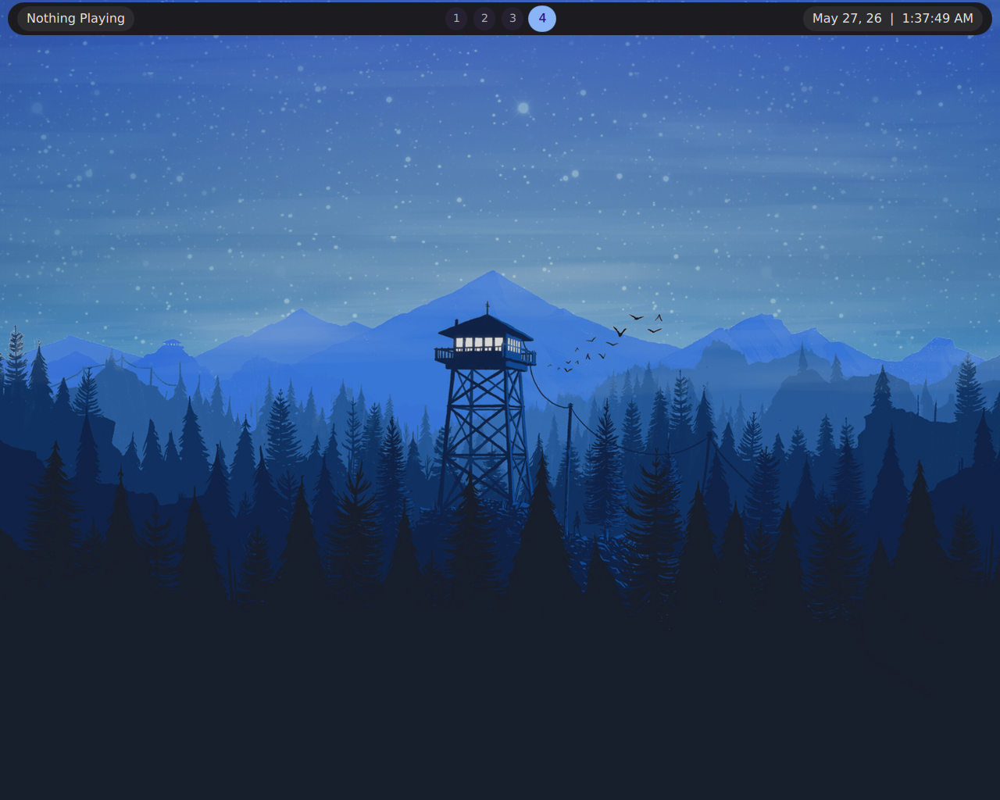
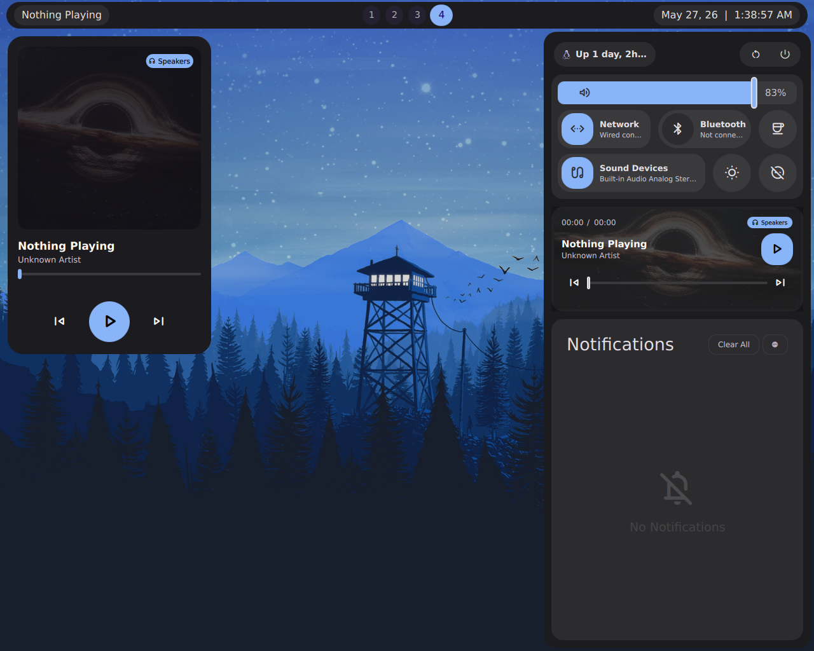

# 🪐 .dotfiles

> My hyprland config files, that i use everyday.

---

## 🖥️ The Ecosystem

| Component | Software | Description |
| :--- | :--- | :--- |
| **OS** | Arch Linux | Bleeding-edge, lightweight base |
| **WM** | Hyprland | Dynamic tiling Wayland compositor with smooth animations |
| **Shell** | Fish | User-friendly, interactive command line with autosuggestions |
| **Editor** | Neovim | Ultra-fast, heavily optimized development environment |
| **Bar / UI** | Quickshell | Custom QML-based status bar, sidebars, and overlays |
| **Terminal** | Foot (Switched over from kitty) | Fast, GPU-accelerated terminal emulator |

---

## 📸 Screenshots

## 📸 Screenshots

| Desktop Overview | Bar & Side Panel |
| :---: | :---: |
|  |  |
